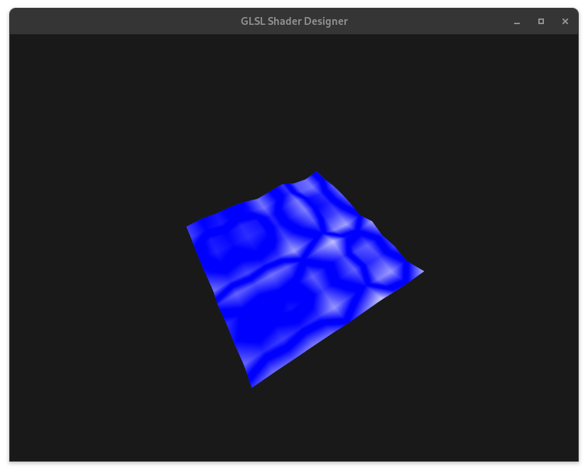

# GLSL Shader Designer

Simple program to test shaders and how they effect scene.
App uses GLFW and GLAD for window and OpenGL context!
There is nothing more complicated than you think, maybe a little bit of eye-bleeding code.

#### App arguments:
<pre>
--help                     | -h              -    Show help prompt
--shape < shape >          | -s < shape >    -    Change shape (cube, plane or plane10x10)
--vertex < path >          | -v < path >     -    Set used vertex shader
--fragment < path >        | -f < path >     -    Set used fragment shader
--compute < path >         | -c < path >     -    Set used compute shader
--tess_evaluation < path > | -te < path >    -    Set used tesselation evaluation shader
--tess_control < path >    | -tc < path >    -    Set used tesselation control shader
--multiply_by < number >   | -mb < number >  -    Multiply all values by this number
</pre>

### Have fun!